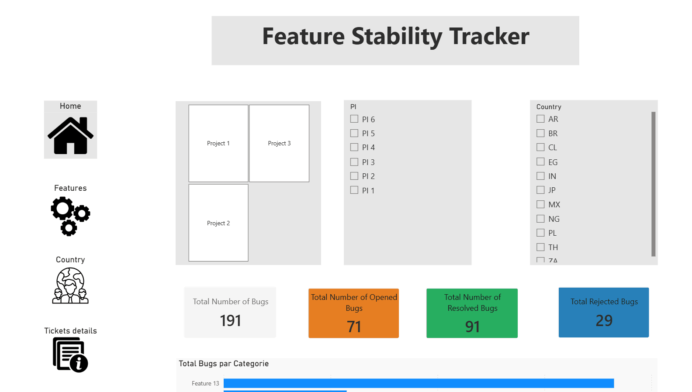

# Feature Stability Tracker


---

## Overview

A Power BI dashboard built to track bug distribution and stability trends across product features, portals, and countries — over multiple Program Increments (PIs).

Built from a **Product Owner perspective**, this project addresses a recurring blind spot in agile delivery: teams often operate on *perceived* feature quality rather than *measured* feature quality. When bug data lives in Jira and is never aggregated, patterns stay invisible — and prioritization decisions are made on instinct rather than evidence.

This dashboard makes those patterns visible.

---

## Demo



---

## Business Context

In a multi-portal, multi-country product organization, bugs are logged continuously in Jira. Without aggregation, three critical questions go unanswered:

**1. Which features are structurally unstable across PIs?**
A single-PI view masks persistence. A feature with 5 bugs in PI 2 and 10 bugs in PI 4 is a systemic risk — not a one-off. The heatmap and trend line surface this immediately.

**2. Where is the bug load concentrated — by feature, portal, and country?**
Gut feeling from standup is not a reliable signal. This dashboard replaces that with a ranked, filterable view that can challenge team assumptions directly.

**3. What is the resolution health of the backlog?**
Knowing total bugs is insufficient. Distinguishing opened, resolved, and rejected bugs per PI tells a more honest story about delivery capacity and quality debt accumulation.

---

## Key Insight Surfaced

> **The most bug-impacted feature contradicted team perception.**

Prior to building this dashboard, the team's informal consensus identified a different feature as the main pain point. The data showed otherwise — one feature accounted for a disproportionate share of bugs across all PIs and portals, a pattern invisible in sprint-level Jira views.

This is precisely the value of aggregating Jira data into a structured analytical layer.

---

## Data Model

Star schema built directly from a Jira CSV export:

```
fact_tickets
├── dim_feature
├── dim_project (portal)
├── dim_country
├── dim_pi
└── dim_status
```

All relationships are single-direction. Filtering flows from dimensions to the fact table.

---

## Dashboard Structure

### 🏠 Home
- KPI cards: Total Bugs / Opened / Resolved / Rejected
- Bar chart: Total bugs per feature (ranked)
- Stacked bar: Bug distribution by status per PI
- Pie chart: Bug share by project/portal

### ⚙️ Features
- **Heatmap**: Feature × PI matrix with conditional formatting (intensity = bug count)
- **Line chart**: Evolution of bug count per PI — TOP 3 features highlighted
- **Cross-table**: Bugs by project × feature × country (drillable)

### 🌍 Project / Country
- Pie charts: Bug status distribution per portal
- Heatmap: Portal × Country × PI
- Horizontal bar: Total bugs by country, stacked by portal

### 🗂️ Tickets Details
- Status kanban summary (6 statuses)
- Granular ticket table: Issue Key / Status / Portal / Country / Feature / Description / Jira URL

---

## Filters Available

| Filter | Values |
|--------|--------|
| Project / Portal | Multi-select tile slicer |
| Feature | Checklist (15 features) |
| PI | Checklist (PI 1 → PI 6) |
| Country | Checklist (11 countries) |

All slicers are cross-filtered and synchronized across pages.

---

## Dataset

- **Source**: Jira CSV export (anonymized for public release)
- **Volume**: 191 tickets
- **Portals**: 3
- **Features**: 15
- **Program Increments**: 6
- **Countries**: 11
- **Statuses**: 6 (Cancelled, Closed, Deployed, In Progress, In Review, Pending Release)

> The dataset has been fully anonymized. Project names, feature names, country codes, ticket IDs, and URLs are replaced with generic labels. The structure and analytical logic are intact.

---

## Technical Stack

- **Power BI Desktop** — report development
- **DAX** — all measures (no Power Query transformations on the data model)
- **CSV** — data source (Jira export)
- **Star schema** — manual data modeling

---

## Architecture

The production version of this dashboard goes beyond the demo available in this repository:

| Layer | Demo (this repo) | Production |
|-------|-----------------|------------|
| Data source | CSV (Jira export) | Snowflake — DirectQuery |
| Feature categorization | Manual in Power BI | SQL `CASE WHEN` at query layer |
| Template | `.pbit` included | `.pbit` included |

---

## How to Use

1. Clone or download the repository
2. Open the `.pbix` file in Power BI Desktop
3. The report loads with the anonymized dataset embedded
4. Use the slicers on each page to filter by portal, feature, PI, or country
5. Navigate between pages via the left sidebar icons

---

## About

Built as a **personal initiative** during an active product mission — not assigned, not requested.

The motivation was simple: the team had Jira data but no structured view of it. Building this dashboard in parallel to delivery work is also a demonstration of what a **data-fluent Product Owner** actually does — not just writing user stories, but instrumenting the product and its delivery process.

---

## Author

**Ali** — Senior Product Owner | Digital · Data · AI | Freelance  
[LinkedIn](https://www.linkedin.com/in/) · [GitHub](https://github.com/)

> *PSPO II · PSM II · SAFe SM 6*
